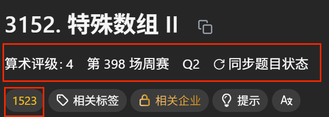
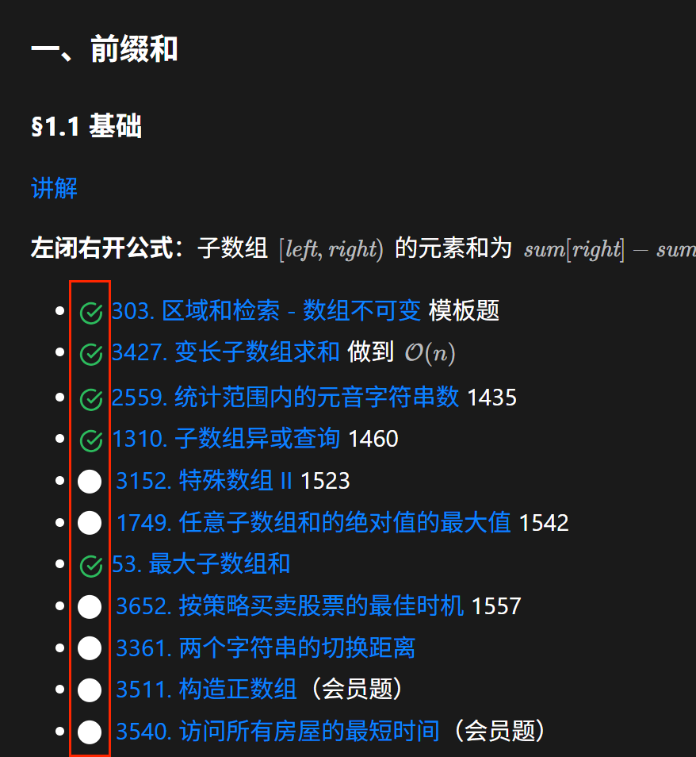
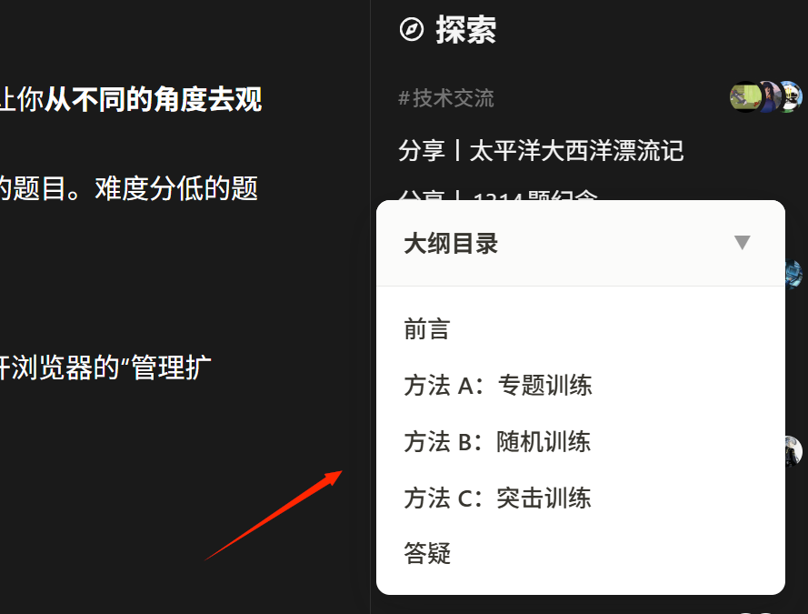
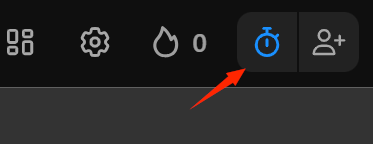

## leetcode_levelShow.user.js

来源：https://scriptcat.org/zh-CN/script-show-page/2778#google_vignette

展示题目难度、是否做过等信息

<table>
  <tr>
    <td align="center" width="18%">
       
      2.1
    </td>
    <td align="center" width="22%">
       
      2.2
    </td>
  </tr>
</table>

## leetcode_md.user.js

来源：https://greasyfork.org/zh-CN/scripts/562330-leetcode-%E5%8A%9B%E6%89%A3-%E9%A2%98%E5%8D%95%E5%A4%9A%E5%8A%9F%E8%83%BD%E7%9B%AE%E5%BD%95%E6%8F%92%E4%BB%B6

展示题单的目录

<figure align="left">
  
  <figcaption></figcaption>
</figure>

## leetcode-native-timer-manual.user.js

防止自动计时

<figure align="left">
  
  <figcaption></figcaption>
</figure>